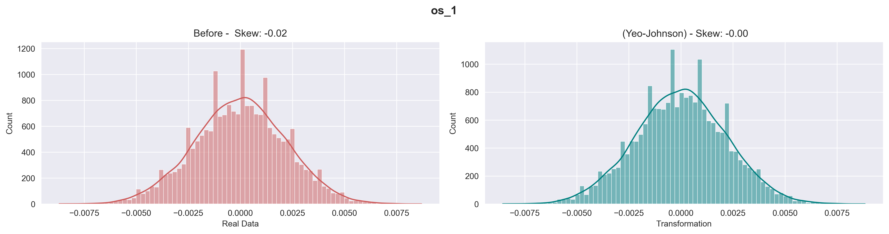
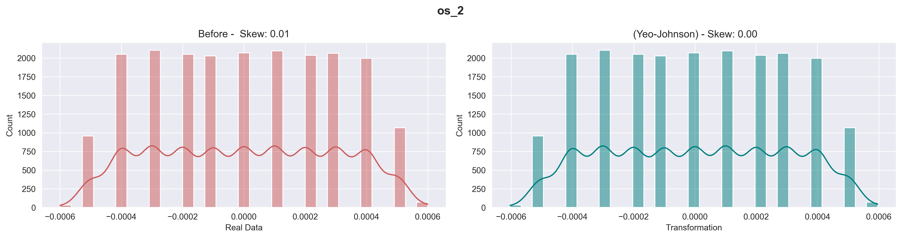
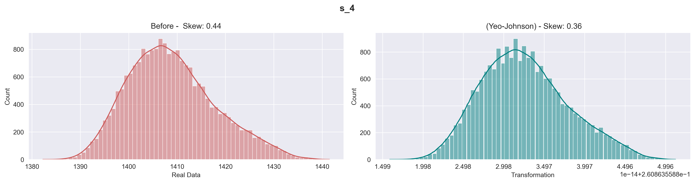
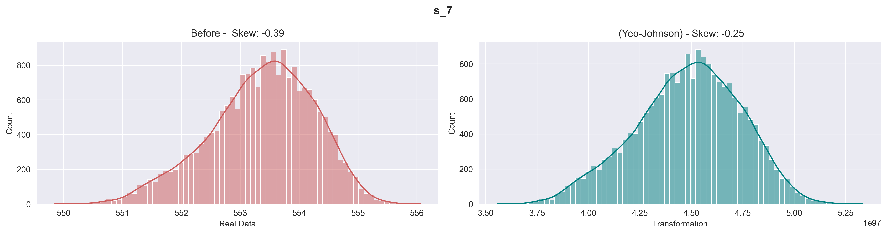
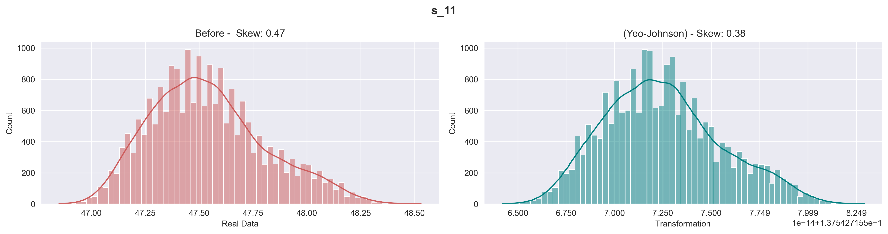
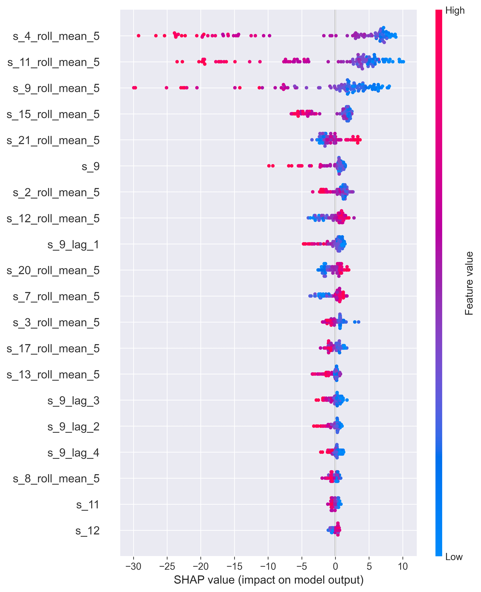
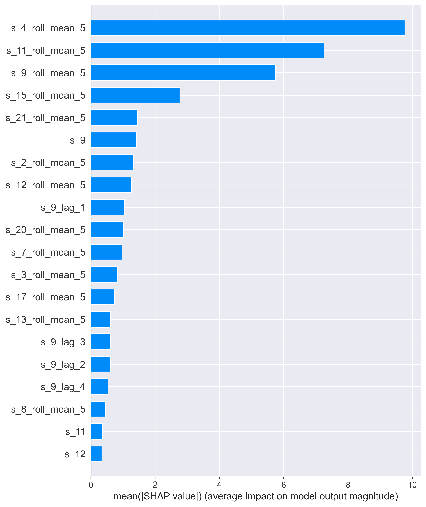
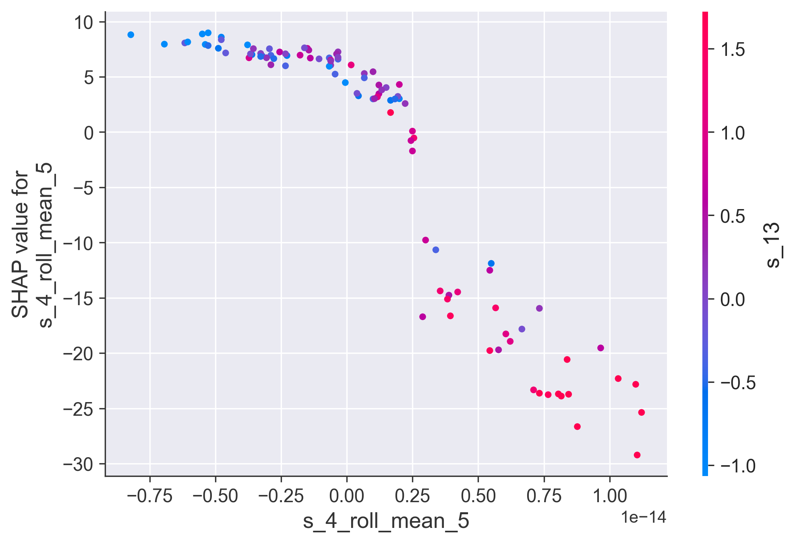

# NASA Turbofan Engine RUL Prediction (FD001)

<p align="center">
  <a href="#english-version">🇬🇧 English Version</a> • 
  <a href="#türkçe-versiyon">🇹🇷 Türkçe Versiyon</a>
</p>

---

<a id="english-version"></a>
## 🇬🇧 English Version

This project focuses on predicting the **Remaining Useful Life (RUL)** of aircraft turbofan engines using the benchmark **NASA C-MAPSS (FD001)** dataset. By leveraging advanced feature engineering, time-series transformations, and state-of-the-art gradient boosting algorithms, this machine learning pipeline achieves highly accurate and explainable prognostic results.

### 🚀 Key Achievements & Architecture
* **Advanced Feature Engineering:** Extracted rolling windows (mean, std) and lagging indicators to capture degradation trends over time instead of relying on single snapshots.
* **Feature Transformation:** Applied **Yeo-Johnson** transformation via PowerTransformer to handle highly skewed sensor data, stabilizing variance across cycles.
* **Piecewise RUL Target Formulation:** Implemented an upper limit threshold of 125 cycles (Piecewise Linear RUL) to accurately model the early wear-free phase of healthy engines, preventing early-stage model confusion.
* **Data Leakage Prevention:** Scaled training and testing data securely by fitting the `StandardScaler` only on the training set and transforming the test set on the final cycle cutoff points.

### 📊 Model Performance Summary
The models were trained on the full lifecycle data and evaluated strictly on the official 100 test engines at their respective last operational cycles:

| Model | R2 Score | MSE | MAE (Cycles) |
| :--- | :---: | :---: | :---: |
| Decision Tree | ~55% - 60% | - | - |
| Random Forest | 71.68% | 488.91 | 16.43 |
| **XGBoost (Champion)** | **80.25%** | **340.98** | **13.33** |

---

### 📈 Feature Transformations (Data Distributions)

The original sensor data distributions were highly skewed and bimodal. To enable the models to better capture variance, a **Yeo-Johnson (Power Transformer)** was applied to shift the features toward a Gaussian (normal) distribution. Below are the sensor distributions before and after transformation:







---

### 🔍 XAI & Model Interpretability (SHAP Analysis)

To break the "black-box" nature of the model and mathematically transparentize the impact of each sensor on engine life, **SHAP (SHapley Additive exPlanations)** analysis was utilized.

#### 1. SHAP Summary Plot


* **What it represents:** This plot ranks features based on their impact on model predictions from top to bottom. The color of the dots represents the feature value (Red = High, Blue = Low), and the horizontal axis shows the impact on the RUL prediction.
* **Analysis:** High values (red dots) of `s_4_roll_mean_5` and `s_11_roll_mean_5` pull the SHAP value to the negative side (left). This indicates that an increase in the moving averages of these sensors is the strongest leading indicator that the engine's remaining useful life (RUL) is rapidly exhausting.

#### 2. Global Feature Importance (Summary Bar Plot)


* **What it represents:** Shows the absolute average impact magnitude ($|SHAP \ value|$) of features on the model's decisions.
* **Analysis:** This proves that when predicting an engine's remaining life, the model relies heavily on our engineered **rolling features (moving averages)** rather than instantaneous raw values. The 5-cycle rolling averages of `sensor 4` and `sensor 11` alone constitute nearly half of the model's entire decision-making mechanism.

#### 3. SHAP Dependence Plot (Sensor 4)


* **What it represents:** Shows the non-linear relationship and critical inflection points between a single feature's change and the model's prediction.
* **Analysis:** Up to a normalized threshold of `0.25` for `s_4_roll_mean_5`, the SHAP impact remains neutral or positive (the engine is healthy). However, the moment the value exceeds `0.25`, the graph drops abruptly, creating a severe negative impact. This mathematically validates the critical threshold where the engine transitions from the steady wear phase to the **rapid failure phase (cliff-edge effect)**.

---

<a id="türkçe-versiyon"></a>
## 🇹🇷 Türkçe Versiyon

Bu proje, **NASA C-MAPSS (FD001)** veri setini kullanarak uçak turbofan motorlarının **Kalan Ömür (RUL)** tahminini gerçekleştirmektedir. Gelişmiş özellik mühendisliği, zaman serisi dönüşümleri ve gradyan artırma (XGBoost) algoritmaları kullanılarak, yüksek doğrulukta ve açıklanabilir tahmini bakım sonuçları elde edilmiştir.

### 🚀 Öne Çıkan Mühendislik Adımları
* **Zaman Serisi Özellikleri:** Anlık sensör verilerinin gürültüsünü engellemek adına son 5 adımın hareketli ortalamaları (`rolling_mean`), standart sapmaları (`rolling_std`) ve gecikme değerleri (`lag`) türetilmiştir.
* **Varyans Kararlılaştırma:** Çarpık (skewed) dağılıma sahip sensör verilerini normal dağılıma yaklaştırmak için **Yeo-Johnson** dönüşümü uygulanmıştır.
* **Parçalı Ömür (Piecewise RUL) Stratejisi:** Motorların aşınmadığı ilk sağlıklı dönemleri doğru modellemek adına hedef değişken 125 çevrim ile sınırlandırılmıştır.
* **Veri Sızıntısı (Data Leakage) Engeli:** `StandardScaler` terazisi sadece eğitim verisinden öğrenilmiş, test setindeki 100 motorun son satırlarına sızıntı olmadan uygulanmıştır.

### 📊 Model Performans Raporu
Modeller tüm yaşam döngüsüyle eğitilmiş ve sadece test setindeki 100 motorun NASA tarafından kapatıldığı son operasyonel satırlarında test edilmiştir:

| Model | R2 Skoru | MSE | MAE (Hata Çevrimi) |
| :--- | :---: | :---: | :---: |
| Decision Tree | ~%55 - %60 | - | - |
| Random Forest | %71.68 | 488.91 | 16.43 |
| **XGBoost (Şampiyon)** | **%80.25** | **340.98** | **13.33** |

---

### 📈 Veri Dönüşümleri (Özellik Dağılımları)

Sensör verilerinin orijinal dağılımları oldukça çarpık (skewed) ve bimodal bir yapıya sahipti. Modellerin varyansı daha iyi kavrayabilmesi için **Yeo-Johnson (Power Transformer)** uygulanarak veriler normal dağılıma (Gaussian) yaklaştırılmıştır. Aşağıda dönüşüm öncesi ve sonrası sensör dağılımları yer almaktadır:


---

### 🔍 SHAP İle Açıklanabilir Yapay Zeka (Model Interpretability)

Her bir sensörün motor ömrüne etkisini matematiksel olarak şeffaflaştırmak adına **SHAP (SHapley Additive exPlanations)** analizi kullanılmıştır.

#### 1. SHAP Özet Grafiği (Summary Plot)


* **Ne İfade Ediyor?** Bu grafik, modelin kararlarını en çok etkileyen özellikleri yukarıdan aşağıya doğru sıralar. Noktaların rengi özelliğin değerini (Kırmızı = Yüksek, Mavi = Düşük), yatay eksen ise RUL tahminine olan etkiyi gösterir.
* **Analiz:** `s_4_roll_mean_5` , `s_9_roll_mean_5` ve `s_11_roll_mean_5` sensörlerinin yüksek değerleri (kırmızı noktalar), SHAP değerini negatife (sola) çekmektedir. Yani bu sensörlerin ortalamasının yükselmesi, motorun kalan ömrünün (RUL) hızla bittiğini gösteren en büyük öncü göstergelerdir.

#### 2. Küresel Özellik Önem Derecesi (Summary Bar Plot)


* **Ne İfade Ediyor?** Özelliklerin model üzerindeki mutlak ortalama etki büyüklüğünü ($|SHAP \ value|$) gösterir.
* **Analiz:** Modelin bir motorun kalan ömrünü tahmin ederken ağırlıklı olarak anlık değerlere değil, türettiğimiz **hareketli ortalamalara (rolling mean)** güvendiğini kanıtlar. `sensor 4` ve `sensor 11`'in 5 çevrimlik hareketli ortalamaları, tek başlarına modelin karar mekanizmasının neredeyse yarısını oluşturmaktadır.

#### 3. Bağımlılık ve Kırılma Grafiği (Dependence Plot - Sensor 4)


* **Ne İfade Ediyor?** Tek bir özelliğin değişimi ile modelin tahmini arasındaki doğrusal olmayan ilişkiyi ve kırılma noktalarını gösterir.
* **Analiz:** `s_4_roll_mean_5` özelliğinin normalize edilmiş değeri `0.25` eşiğine kadar SHAP etkisini sıfır veya pozitif tutmaktadır (motor sağlıklı). Ancak değer `0.25`'i geçtiği an grafik dikey olarak küt diye aşağı düşmekte ve negatif etki yaratmaktadır. Bu durum, motorun aşınma evresinden **hızlı arıza evresine (uçurum etkisi)** geçtiği kritik eşik değerini doğrulamaktadır.

---

### 🛠️ Installation & Usage / Kurulum ve Kullanım

```bash
# Clone the repository / Depoyu kopyalayın
git clone [https://github.com/berkaylacinkaya/NASA_CMAPSS_TURBOFAN_ENGINE-PdM-.git](https://github.com/berkaylacinkaya/NASA_CMAPSS_TURBOFAN_ENGINE-PdM-.git)

# Install dependencies / Gerekli kütüphaneleri yükleyin
pip install -r requirements.txt